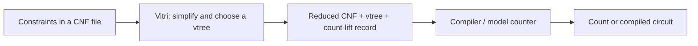

<p align="center">
  
</p>

<p align="center">
  <a href="https://github.com/Tractables/vitri/actions/workflows/ci.yml"></a>
  <a href="https://tractables.github.io/vitri/"></a>
  <a href="LICENSE"></a>
  <a href="https://crates.io/crates/vitri"></a>
  <a href="https://docs.rs/vitri"></a>
</p>

**Prepare Boolean constraints for counting and circuit compilation.**

Vitri simplifies a Boolean formula and chooses how to group its variables
for a downstream compiler. That grouping can affect the compiler's runtime
and memory use. It is a Rust library and a command-line tool.

For example, you might want to count the configurations that satisfy a set of
rules, compute probabilities with weighted model counting, or compile those
rules into a circuit for repeated queries.



A **CNF** is a Boolean formula written as clauses that must all hold; DIMACS is
its text-file format. A **vtree** is a binary tree that groups the variables
for compilation. A **tree decomposition** helps some of Vitri's algorithms
construct that tree. The downstream compiler builds the **circuit**, which
represents the satisfying assignments.

## Start here

**[Count a small configuration problem with PySDD or RSDD](docs/getting-started.md)**
walks from the constraints through Vitri to a checked answer using either
compiler's `.vtree` input.

| Your goal | Where to start |
| --- | --- |
| Count valid configurations | [The complete counting tutorial](docs/getting-started.md) |
| Compile a circuit for later queries | [Preserving the Boolean function](docs/getting-started.md#compile-for-later-queries) |
| Use Vitri in a Rust application | [The API's worked example](https://docs.rs/vitri/latest/vitri/#a-worked-example) |
| Supply your own CNF or integrate another solver | [Output bundle](docs/bundle.md) and [preprocessing modes](docs/preprocessing.md) |

## Install and run

Install the native [build prerequisites](docs/building.md#toolchain), then:

```sh
cargo install vitri --locked
vitri instance.cnf --out-dir bundle/ --budget-ms 60000
```

This writes the reduced formula, its vtree, and the record needed to translate
the solver's count back to the original formula. The tutorial supplies an input
file and the downstream commands. To build from a checkout, use
`cargo build --release`.

## Vtrees

`--dot` writes a Graphviz file next to every `.vtree` a run emits. For
the [tutorial input](docs/getting-started.md), twelve variables in three groups
of four, downloaded as `choices.cnf`:

```sh
vitri choices.cnf --out-dir bundle/ --mode compile --vtree force --dot
dot -Tpng -Gbgcolor=white -Gsplines=ortho -Nwidth=0.75 -Gnodesep=0.5 \
    bundle/vtree.dot -o bundle/vtree.png
```


Node fill is clause load. [`docs/vtrees.md`](docs/vtrees.md) describes the
constructions and how the portfolio selects among them.

**[Vtree showcase](docs/showcase.md):** compare every construction family and
parameter axis on one formula, before and after preprocessing.

## Modes

`--mode` states what preprocessing must preserve. Without it the mode is read
from the instance's headers (`c t <track>`, `c p show`, `c p weight`).

| task | `--mode` |
| --- | --- |
| model counting | `mc` |
| weighted model counting | `wmc` |
| projected counting | `pmc` |
| projected weighted counting | `pwmc` |
| compilation (function-preserving) | `compile` |

The stages each mode permits are listed in
[`docs/preprocessing.md`](docs/preprocessing.md).

## Output

| file | contents |
| --- | --- |
| `reduced.cnf` | the formula to compile, renumbered and self-describing |
| `preprocess.json` | the lift, the variable map, the forced and free variables |
| `vtree.vtree` | the selected vtree |
| `components.json` | the connected-component split and how the component counts compose |
| `components/`, `candidates/` | one `.cnf` + `.vtree` per component; runner-up vtrees under `--candidates` |

The show set and the weight table in the bundle come from preprocessing, not
from the input; read both from the bundle. [`docs/bundle.md`](docs/bundle.md)
documents every field.

## Documentation

- [`docs/bundle.md`](docs/bundle.md) — the output files, field by field.
- [`docs/preprocessing.md`](docs/preprocessing.md) — what each stage removes,
  how the record restores the count, and projection-safe operations for
  derived formulas.
- [`docs/vtrees.md`](docs/vtrees.md) — the vtree constructions, the portfolio,
  bringing your own decomposition.
- [`docs/showcase.md`](docs/showcase.md) — every `--vtree` spec on one CNF.
- [`docs/env.md`](docs/env.md) — the `VITRI_*` environment variables, all
  optional.
- [`docs/sat.md`](docs/sat.md) — the SAT solver vitri links and exposes.
- [`docs/building.md`](docs/building.md) — toolchain, prerequisites, the
  vendored C++ build.

## Licence

Apache License 2.0 ([`LICENSE`](LICENSE)). Third-party components and their
licences: [`THIRD-PARTY.md`](docs/THIRD-PARTY.md). The algorithms this tool
builds on: [`ACKNOWLEDGEMENTS.md`](docs/ACKNOWLEDGEMENTS.md). Contributing:
[`CONTRIBUTING.md`](docs/CONTRIBUTING.md).
