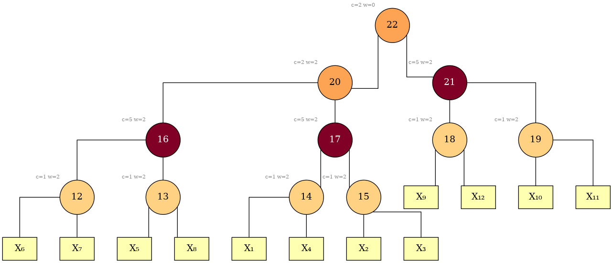

<p align="center">
  
</p>

<p align="center">
  <a href="https://github.com/Tractables/vitri/actions/workflows/ci.yml"></a>
  <a href="https://tractables.github.io/vitri/"></a>
  <a href="LICENSE"></a>
  <!-- Once the crate is on crates.io, add:
       <a href="https://crates.io/crates/vitri"></a>
       <a href="https://docs.rs/vitri"></a> -->
</p>

**CNF preprocessing and vtree (variable tree) construction for circuit compilation and model counting.**

`vitri` is a Rust library with a command-line front end. Given a DIMACS CNF it
produces:

- a reduced CNF, renumbered and self-describing;
- a vtree over it, one per independent component;
- a preprocessing record: the arithmetic that lifts a count over the reduced
  formula back to the original.

The output does not depend on a back end. It can be used with d-DNNF, SDD and
tree decision diagram (TDD) compilers, or with any model counter that takes a
vtree.

Depending on the mode, preprocessing combines SAT simplification, backbone
and equivalence detection, gate-aware defined-variable elimination, and
[Arjun](https://github.com/meelgroup/arjun) independent-support minimization.
The bundle records the resulting variable map and count lift. Vtree
construction scores a portfolio built on
[goatd](https://github.com/Tractables/goatd), including FlowCutter
decompositions, elimination and refinement schedules, and recursive graph and
hypergraph bisections, against the reduced CNF, then keeps the best realized
tree.

## Build

```sh
cargo build --release   # ./target/release/vitri
cargo install --path .  # or put `vitri` on your PATH, as the examples below assume
```

Prerequisites and the vendored C++ build: [`docs/building.md`](docs/building.md).

## Run

```sh
$ vitri docs/example.cnf --out-dir bundle/ --budget-ms 60000
[simplify] 0 clauses removed, 0 literals shortened, 0 forced vars
[dve-round 1] 0 equiv + 3 dve eliminated, 13 clauses
[dve-total] 3 defined + 0 equiv + 0 free eliminated, 12 → 9 vars, 13 clauses
[portfolio] wall_ms=11 vars=9 budget_ms=59991 skip=-
[portfolio] selected: flowcutter-primal (metric=cost, stddev=0.52, cost=17.74)
input:        docs/example.cnf (12 vars, 25 clauses, mode mc)
reduced:      9 vars, 13 clauses  (count(original) = count(reduced) * 2^0)
vtree:        portfolio (9 leaves, 17 nodes)
components:   1 (0 free variables)
wrote:        bundle/reduced.cnf
              bundle/preprocess.json
              bundle/vtree.vtree
              bundle/components.json
elapsed:      20 ms
```

Compile `bundle/reduced.cnf` under `bundle/vtree.vtree` to get a count over the
reduced formula. The count of the original is

```text
count(original) == count(reduced) * 2^count_lift_pow2 * weight_lift
```

with both lift values in `preprocess.json`. Components can also be compiled
separately, each under its own vtree, and the results multiplied.

## Vtrees

`--dot` writes a Graphviz file next to every `.vtree` a run emits. For
[`docs/example.cnf`](docs/example.cnf), twelve variables in three groups of
four:

```sh
vitri docs/example.cnf --out-dir bundle/ --mode compile --vtree force --dot
dot -Tpng -Gbgcolor=white -Gsplines=ortho -Nwidth=0.75 -Gnodesep=0.5 \
    bundle/vtree.dot -o bundle/vtree.png
```



Node fill is clause load. [`docs/vtrees.md`](docs/vtrees.md) describes the
constructions and how the portfolio selects among them.

**[Vtree showcase](docs/showcase.md):** compare every construction family and
parameter axis on one formula, before and after preprocessing.

## Modes

`--mode` states what preprocessing must preserve. Without it the mode is read
from the instance's headers (`c t <track>`, `c p show`, `c p weight`).

| task | `--mode` |
| --- | --- |
| model counting | `mc` |
| weighted model counting | `wmc` |
| projected counting | `pmc` |
| projected weighted counting | `pwmc` |
| compilation (function-preserving) | `compile` |

The stages each mode permits are listed in
[`docs/preprocessing.md`](docs/preprocessing.md).

## Output

| file | contents |
| --- | --- |
| `reduced.cnf` | the formula to compile, renumbered and self-describing |
| `preprocess.json` | the lift, the variable map, the forced and free variables |
| `vtree.vtree` | the selected vtree |
| `components.json` | the connected-component split and how the component counts compose |
| `components/`, `candidates/` | one `.cnf` + `.vtree` per component; runner-up vtrees under `--candidates` |

The show set and the weight table in the bundle come from preprocessing, not
from the input; read both from the bundle. [`docs/bundle.md`](docs/bundle.md)
documents every field.

## Documentation

- [`docs/bundle.md`](docs/bundle.md) — the output files, field by field.
- [`docs/preprocessing.md`](docs/preprocessing.md) — what each stage removes,
  how the record restores the count, and projection-safe operations for
  derived formulas.
- [`docs/vtrees.md`](docs/vtrees.md) — the vtree constructions, the portfolio,
  bringing your own decomposition.
- [`docs/showcase.md`](docs/showcase.md) — every `--vtree` spec on one CNF.
- [`docs/env.md`](docs/env.md) — the `VITRI_*` environment variables, all
  optional.
- [`docs/sat.md`](docs/sat.md) — the SAT solver vitri links and exposes.
- [`docs/building.md`](docs/building.md) — toolchain, prerequisites, the
  vendored C++ build.

## Licence

Apache License 2.0 ([`LICENSE`](LICENSE)). Third-party components and their
licences: [`THIRD-PARTY.md`](THIRD-PARTY.md). The algorithms this tool builds
on: [`ACKNOWLEDGEMENTS.md`](ACKNOWLEDGEMENTS.md). Contributing:
[`CONTRIBUTING.md`](CONTRIBUTING.md).
